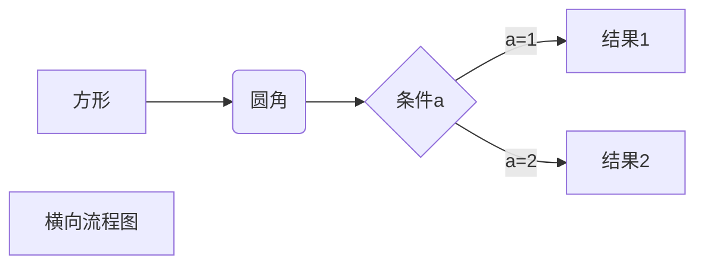

- 斜体：`*斜体文本*`
- 粗体：`**粗体文本**`
- 分割线：`***`
- 脚注：`[^tag], 然后 [^tag]: 就行`
- 代码： ` ```javascript````
 ```javascript
$(document).ready(function () {
    alert('RUNOOB');
});
```
- 链接：`[链接名称](链接地址)`
- 图片：``
- 表格：   |  表头   | 表头  | |  ----  | ----  |


|  表头   | 表头  |
|  ----  | ----  |
| 单元格  | 单元格 |
| 单元格  | 单元格 |

流程图：


